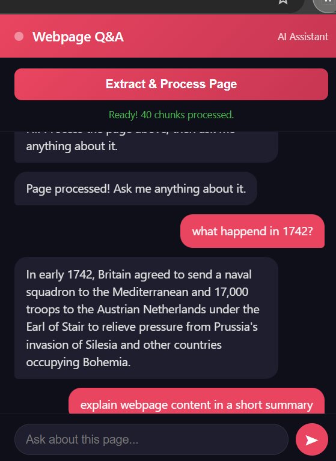
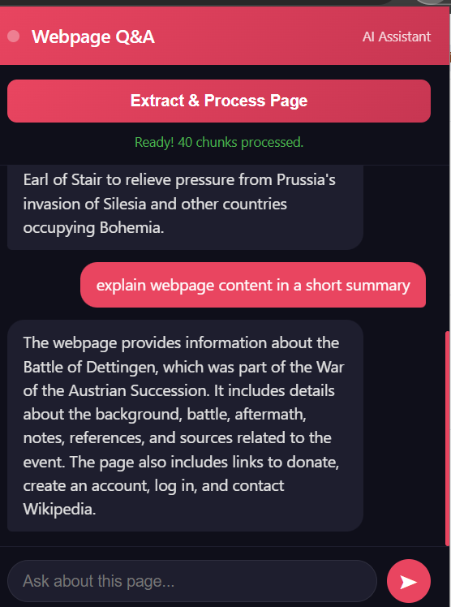

# 🔍 Webpage Q&A — Your AI Assistant for Any Webpage

> Built at 2 AM. Powered by RAG. Works on any webpage, in real time.


---

## What is this?

Most days, we read dozens of webpages — research papers, news, documentation, Wikipedia articles. We skim. We forget. We re-read.

**What if you could just ask?**

Webpage Q&A is a Chrome Extension that turns any webpage into an interactive knowledge base using a full **Retrieval-Augmented Generation (RAG)** pipeline — built from scratch, end to end.

---

## Demo

| Q&A in Action | Summary Generation |
|:---:|:---:|
|  |  |

---

## How It Works

```
User opens any webpage
          ↓
Clicks the Webpage Q&A Chrome Extension
          ↓
Content script extracts all visible page text
          ↓
Text is sent to FastAPI backend
          ↓
LangChain splits text → chunks (500 chars, 50 overlap)
          ↓
OpenAI Embeddings converts chunks → vectors
          ↓
FAISS indexes vectors in-memory (per session, per page)
          ↓
User types a question in the chat UI
          ↓
Semantic search finds most relevant chunks
          ↓
GPT-3.5 Turbo generates a grounded answer
          ↓
Answer appears in the chat bubble UI
```

> No hallucination. No generic answers. Strictly page-grounded responses.

---

## Tech Stack

| Layer | Technology | Purpose |
|---|---|---|
| Chrome Extension | Manifest V3 | Frontend + page text extraction |
| Backend | FastAPI (Python) | REST API server |
| RAG Pipeline | LangChain | Chunking + retrieval chain |
| Vector Store | FAISS | In-memory semantic search |
| Embeddings | OpenAI Embeddings | Text → vector conversion |
| LLM | GPT-3.5 Turbo | Answer generation |
| Config | python-dotenv | Secure API key management |

---

## Features

- **Real-time extraction** — content script pulls visible page text instantly
- **RAG pipeline** — answers grounded strictly in current page content
- **Per-session vector store** — each webpage gets its own isolated FAISS instance
- **Chat bubble UI** — clean, conversational, minimal interface
- **CORS handled** — extension to backend communication seamless
- **Works everywhere** — Wikipedia, research papers, news, documentation, blogs

---

## Project Structure

```
webpage-qa/
│
├── assets/
│   ├── demo1.png               # Q&A demo screenshot
│   └── demo2.png               # Summary demo screenshot
│
├── backend/
│   ├── main.py                 # FastAPI server + full RAG pipeline
│   ├── requirements.txt        # Python dependencies
│   └── .gitignore              # Keeps .env safe
│
└── extension/
    ├── manifest.json           # Chrome Extension config (Manifest V3)
    ├── popup.html              # Chat UI — dark theme
    ├── popup.js                # Core logic — extract, ingest, query
    └── content.js              # Content script
```

---

## Getting Started

### Prerequisites
- Python 3.10+
- Google Chrome
- OpenAI API Key

### 1. Clone the repo
```bash
git clone https://github.com/Sneha8271/Webpage-qa.git
cd Webpage-qa
```

### 2. Backend setup
```bash
cd backend
pip install -r requirements.txt
```

Create a `.env` file inside `backend/`:
```
OPENAI_API_KEY=your_openai_api_key_here
```

Start the server:
```bash
uvicorn main:app --reload
```
Backend runs at `http://127.0.0.1:8000`

### 3. Load the Chrome Extension
- Open Chrome → go to `chrome://extensions`
- Toggle **Developer Mode** ON
- Click **Load unpacked**
- Select the `extension/` folder

### 4. Use it!
- Open **any webpage**
- Click the **Webpage Q&A** icon in your toolbar
- Hit **Extract & Process Page**
- Ask anything about the page!

---

## Example Queries

```
"Give me a short summary of this page"
"What happened in 1742?"
"Who are the key people mentioned here?"
"What is the main argument of this article?"
"List all the important dates mentioned"
```

---

## What I Learned Building This

- **Chrome Extension architecture** — Manifest V3, content scripts, service workers, message passing
- **RAG pipeline from scratch** — chunking strategy, embedding generation, vector retrieval
- **FAISS** — in-memory vector indexing, per-session isolation
- **FastAPI** — async endpoints, CORS middleware, Pydantic models
- **LangChain v2** — LCEL chains, breaking changes navigation, prompt templates
- **Full stack integration** — browser extension communicating with a Python backend

---

## Built By

**Sneha Singh**
B.Tech — Electronics & Computer Science, KIIT Bhubaneswar (2023–2027)

[](https://linkedin.com/in/sneha-singh-075a622aa)
[](https://github.com/Sneha8271)

---

## License

MIT License — feel free to use, modify, and build on this!
